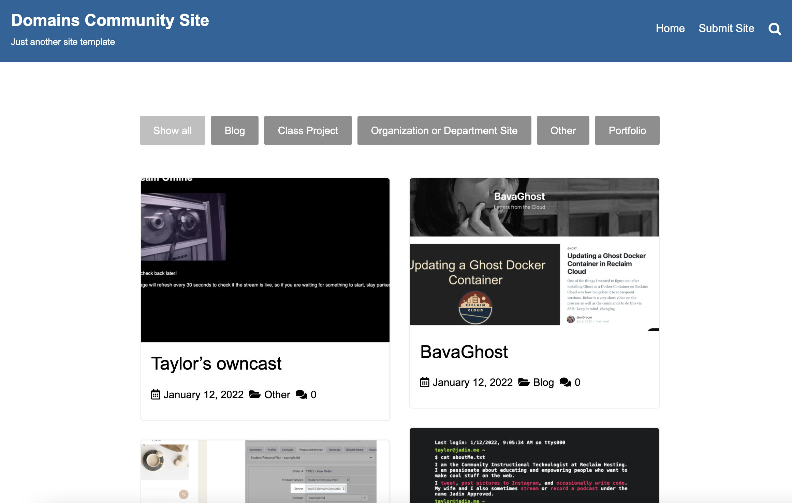

Yesterday Reclaim Hosting [had its first "Community Chat" ](https://community.reclaimhosting.com/t/community-chat-jan-12-2022/4076/7)and I got to host it. The chat was focused around a site template I put together that is intended to help Domains admins showcase the work students, staff, and faculty are doing on their campus. The idea to make tools to build community around domains is [not](https://www.youtube.com/watch?v=hCYBxrFkR1A&list=PLpK5svzslv8qi8YZjqJqKS2hLEGwnUPF0&index=5) [new](https://drive.google.com/file/d/1zFYxpcjD4uHsUlvBXrwutNxljUPSHhly/view) [at](https://inspire.opened.ca/) [all](https://create.ou.edu/creaties/), but I was hoping to make something that schools that were new to DoOO could get started with and would be simple and flexible enough to grow with their needs over time. If there happens to be a Domains admin reading this, reach out to [support@reclaimhosting.com](mailto:support@reclaimhosting.com) and we can put the template on your server. I'm thinking if this template works out well for people, it may be something we build into the DoOO setup for new schools.

The template is just simple Gravity Forms powered web form that asks for a URL, screenshot, and some information about the website that one might want to feature then creates a post in WordPress that's pending review. I've got a demo of the final product here: [demo.jadin.me](https://demo.jadin.me/community)

As well as demoing the site template, I also wanted use the community chat to talk more broadly about building community, and I was really encouraged by how many people spoke up in the chat and unmuting their mics. There is a recording of the community chat below:

<iframe width="560" height="315" src="https://www.youtube.com/embed/jsb0qSIP3b4" title="YouTube video player" frameborder="0" allow="accelerometer; autoplay; clipboard-write; encrypted-media; gyroscope; picture-in-picture" allowfullscreen></iframe>

There are also a few nuts and bolts things that I wanted to document. For signups, I just used a simple Google Form. I then installed the [formLimiter](https://workspace.google.com/marketplace/app/formlimiter/538161738778) add-on on the form, to automatically stop registrations after the event was over. You can also use that add-on to shut off registrations after a certain number of people sign-up or a few other conditions, it's pretty handy. In addition to this, I wanted to see at a glance which schools had more than one person register, so I used conditional formatting with this custom formula to find duplicate entries in the relevant column (which happened to be column E): `=countifs(E:E,E1)>1`  

Finally, I used the [Form Mule](https://workspace.google.com/marketplace/app/form_mule_email_merge_utility/968670674230) add-on for Google Sheets to do a mail merge to let folks who registered know how they could join the call. I've used this add-on many times before, and the cool thing about this particular add-on is it is free to use (developed by [New Visions for Public Schools](https://www.newvisions.org/pages/about-us)) and it can be set to run as soon as someone fills out your form, which is great for catching late signups. 

I'm excited about future community chats but there are some things I immediately what to fix for next time. We used [Whereby](https://whereby.com/) as our video platform, which I'm a big fan of due to its simplicity, but it unfortunately only allows 12 people to have their camera active in a call, and its recording capabilities are limited. For recording, it basically takes a capture of the whereby browser tab, which means that if you resize the window, it changes the effective resolution of the recording. It also means you can see the host's mouse moving around and clicking on stuff. You can see both of these things in the above recording. Now that I know that for next time I can avoid both of those problems, but it might also be worth exploring different platforms for these chats in the future. 