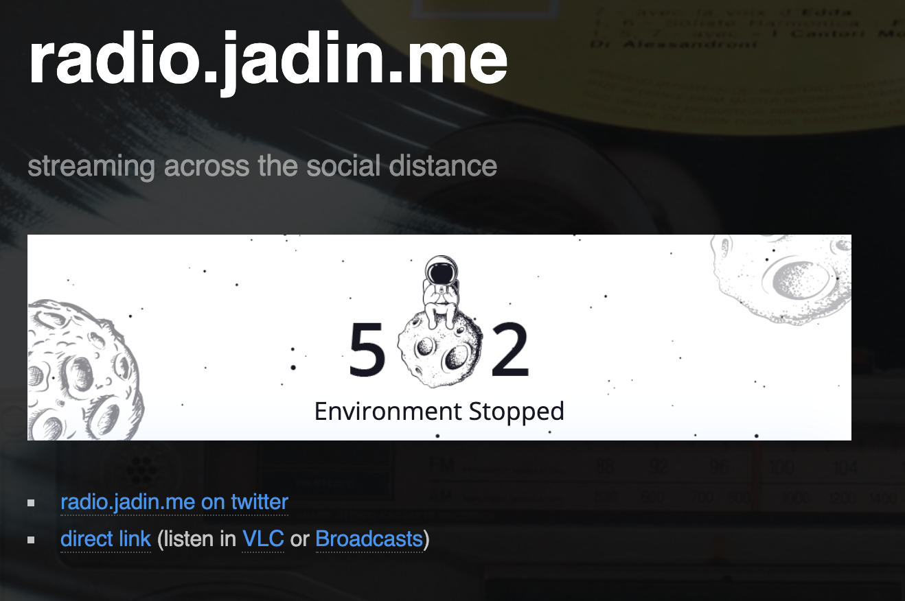
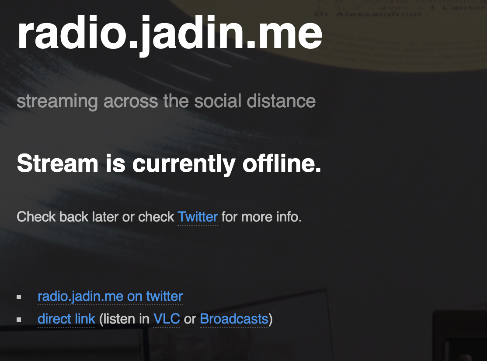
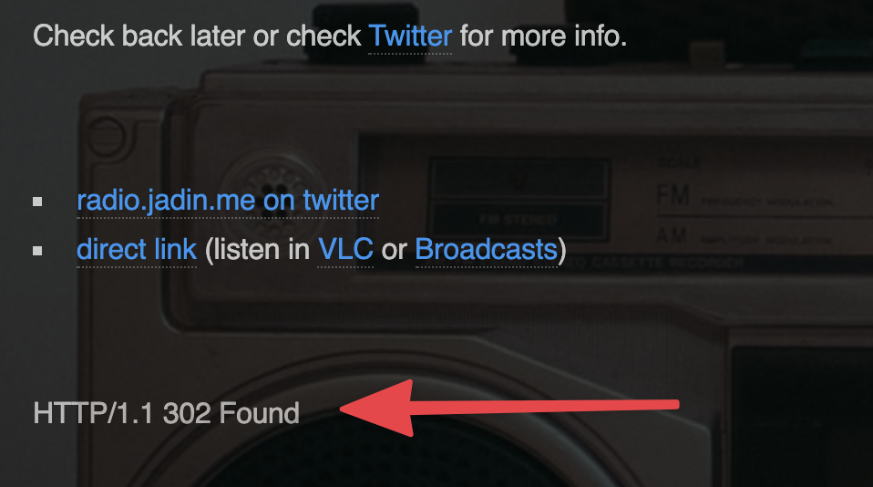

I haven’t revisited it in a while, but one of my favorite little projects I dug into at the beginning of the pandemic was [making my own little radio station using Azuracast](https://bavatuesdays.com/a-radio-of-ones-own-an-interview-with-taylor-jadin-on-ds106radio/). I need to get back to that, but one of the things on my checklist was to make a small improvement to the landing page for it, [radio.jadin.me](https://radio.jadin.me).

The look of the landing page I was already pretty satisfied with, it's just an [HTML5UP template](https://html5up.net/) that I customized and put the embedded player, however, I want the page to show the player when my Azuracast instance is running, and to say that the stream is offline when I have Azurcast stopped to save money. I was doing this manually by just commenting out bits of the HTML that included the player whenever I would shut the station down, but I knew there were better ways that I just didn't have the time to investigate.

Why bother with this at all? If I left the page the same when the Azurcast instance I had in Reclaim Cloud environment shut down, the page would look like this:



Nothing wrong with that I suppose, but I would prefer a nicer looking page like this:



People who know anything about PHP will probably find this obvious, but the solution for me (credit to [Tim Clarke](https://twitter.com/floatingtim) for suggesting I look into this like a year ago!) was to make a simple page that uses PHP to get check if something was available, then display different content based on that. There are a lot of simple ways to do this, but I just made two pages,`online.html`, and `offline.html`  that look how I want them to look when the station is available or not. Then with a little bit of research, I put together an `index.php` that just returns the appropriate version of the page if the Reclaim Cloud environment is online. Basically, I just put the url to the environment in the `$url` variable, and if that returns an  HTTP response status code of 200 (which means things are working), it will load `online.html`. If it receives something different, it loads `offline.html` instead. You can see the script below:

## index.php

```php
<?php
$url = 'https://radiosrv.us.reclaim.cloud/public/radio.jadin.me/embed';
$online = 'HTTP/1.1 200 OK'
$headers = @get_headers($url);
if(!$headers || $headers[0] == $online) {
    // Hey we are online
    readfile("online.html");
}
else {
    // Offline
    readfile("offline.html");
    // Uncomment the following line to see what the status currently is
    // echo($headers[0]);
}
?>
```

You can also see on the third to last line that I made a section that will actually put the current HTTP status code at the bottom of the page (if you uncomment that line). This is in case whatever application you are running returns something other than 200, like 302 (which would be a redirect). If the `$online` variable doesn’t match what code your application returns when it is running this whole setup won’t work. If that is the case you would delete the two slashes at the beginning of the line, load the web page, and it will show you that code:



Then you would simply change the `$online` variable in `index.php` to that error code it gave you.

So with that done, I threw `index.php`, `online.html`, and `offline.html` on my subdomain using my FTP client and I was ready to go! Now when I start my radio station in Reclaim Cloud, my [radio.jadin.me ](https://radio.jadin.me)landing page automatically shows that the station is online!
