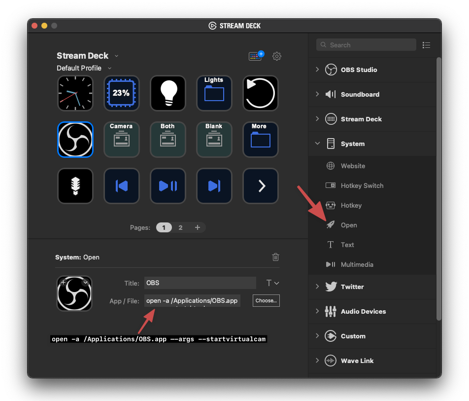

---

title: Starting OBS with Virtual Camera enabled on the Mac using a Stream Deck
date: 2021-12-14
tags:

- tools

---

Hey maybe you will find this useful if you:
1. Use macOS
2. Use OBS’s Virtual Camera feature to send the output of OBS to Discord, Zoom, etc.
3. Have a [Stream Deck](https://www.elgato.com/en/stream-deck)
4. Are annoyed that you are constantly opening OBS and clicking the “Start Virtual Camera” button

Now that I’ve shaved down the audience for this post, I just wanted to share a few things I learned when trying to come up with a way to have OBS launch with Virtual Camera already enabled. If you search around for this you will [find launch arguments for folks on Windows](https://ideas.obsproject.com/posts/1120/option-to-automatically-start-virtual-camera) that can automatically start the camera, but not many references to doing this on a Mac. Luckily you can pretty easily pass launch arguments to apps on macOS from the terminal using the `open` command:


So to do this from the terminal the command looks like this:

```bash
open -a /Applications/OBS.app --args --startvirtualcam
```

However, typing this on the terminal every time I want to start OBS obviously won’t save me any time. There are some things you could do, you could save this in a text file and change the file extension to `.command` which will let you double click to run that command in a terminal window, but that's not very slick either, even though it may be fast. I wanted to see if I could do this via my Stream Deck.

My first idea was to make a one-line script or Automator action and then point the Stream Deck to open that script, but I found it can be way simpler than that! It turns out the stream deck software has built-in suppot for running a terminal command in the background, it's just not terribly obvious. All you need to do is add a new Open action, then paste the terminal command from before in the App/File box.



BOOM, now you can click a button and OBS will start with the Virtual Camera feature already started up and ready to go. For bonus points, you can even go into OBS’s settings and enable the System Tray, and the “Minimize to system tray when started” checkbox, and you won’t even have hide/minimize the window after OBS starts.

