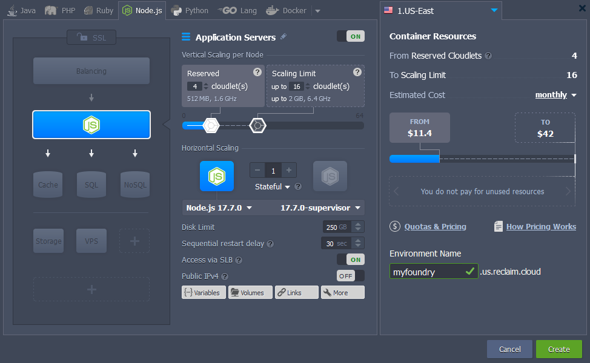
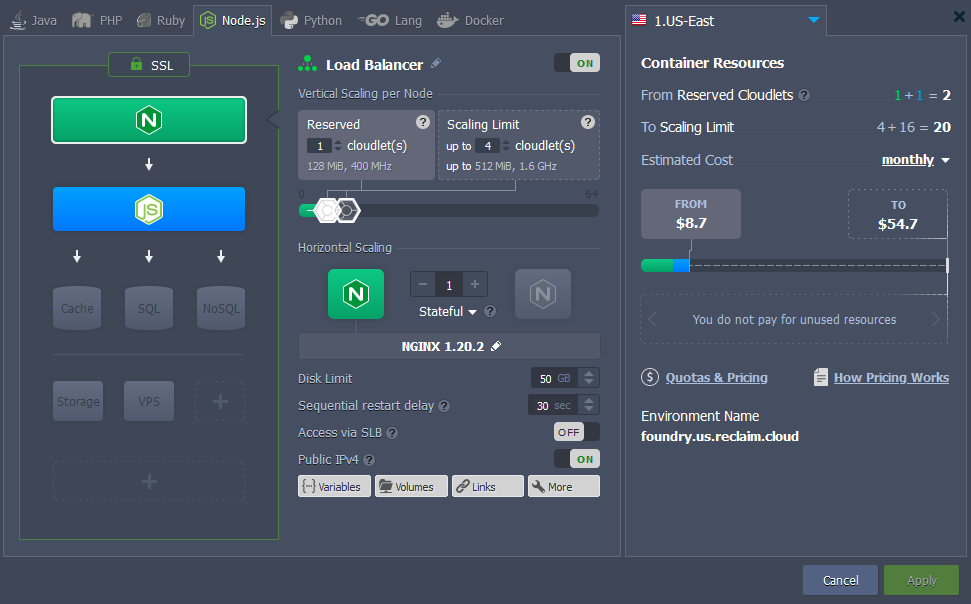

I've had this post sitting incomplete in my drafts for a long time! 

[Foundry Virtual Tabletop](https://foundryvtt.com/) is an excellent, self-hostable virtual tabletop tool. You use it to play tabletop RPGs with other folks over the internet, (check the link above out if you are curious). It is a paid, NodeJS application that you can run on your own computer or on a server.

This won't be a comprehensive tutorial on foundry itself after install, but I want to cover the basics and the Reclaim Cloud specific things that you will need if you don't want to have to worry about manually starting the foundry application every time you restart a container (the foundry guide doesn't cover this). You can also [run foundry in Reclaim Cloud using docker containers](https://video.jadin.me/w/sUCuVKBHjecn3oCTAGd5mS), but there are no officially maintained containers at this time, and I found issues with foundry plugin compatibility using Docker, so I went with the method below.

First make a new environment, select node at the top of the window, enter your environment name, and set your cloudlets how you'd like them:



You will also likely want to hit the SSL button, and enable built-in SSL, particularly if you aren't going to be mapping a custom domain and will instead be using the shared load balancer and the subdomain it gives you.

The first thing we are going to do is get rid of the sample node application that comes preinstalled. Click the web SSH button and run this command in your foundry container:
```bash
rm -r ~/ROOT/*
```

Now we're going to basically just follow the instructions on the foundry website:
```shell
# Create application and user data directories
cd $HOME
mkdir foundryvtt
mkdir foundrydata

# Install the software
cd foundryvtt
wget -O foundryvtt.zip "<foundry-website-download-url>"
unzip foundryvtt.zip

# Start running the server
node resources/app/main.js --dataPath=$HOME/foundrydata
```

This will start the foundry in the terminal, but if you try to load the URL, you probably won't see anything yet, as Foundry listens on port 30000 and Jelastic checks for port forwards when it starts a container. For now, you can just quit foundry by using the keyboard shortcut **ctrl+c**

Now, we need to set up Foundry to auto start when the container launches! We will make a symlink that will allow Jelastic to launch our application. By default, Jelastic is configured to launch `server.js` in the `~/ROOT` folder, instead of adjusting this, I find it simpler to just make this symlink:
```bash
ln -s ~/foundryvtt/resources/app/main.js ~/ROOT/server.js
```

Finally, we need to make a symlink from Foundry's default config directory, to where we actually want our data stored in the home folder where it is easier to find.
```bash
ln -s ~/foundrydata ~/.local/share/FoundryVTT
```

Now you can restart your Application Server container, and foundry should load up automatically! Visit the URL for your environment to check it out.

You will the need your foundry key to put in the web page, and you can customize settings. You can customize most settings in the web UI, or by editing Foundry's `options.json` file. You should be able to find the file at the following path if you followed the above instructions for install: `/home/jelastic/foundrydata/Config/options.json`

Lastly, if you want to map a custom domain for your foundry server, you will need to add an NGINX load balancer to your environment.


In addition to that, if you want to redirect traffic to HTTPS while using a custom domain (because foundry itself won't do that), [the load balancer can be configured to do this](https://support.elastx.se/hc/en-us/articles/214239226-Redirect-to-https-in-nginx-load-balancer).
