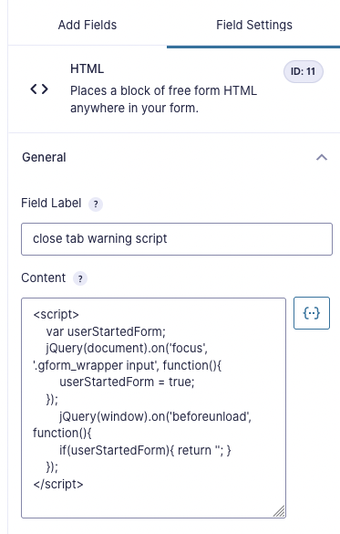
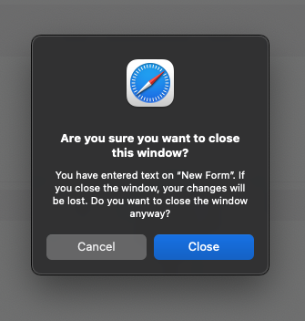

Blogging this before I forget it!

I needed to add a warning to a form in Gravity Forms in case someone started filling out a form but forgot to click the submit button before closing the page. I've seen plenty of pages do this before, and figured there might be away to easily do something like this in Gravity Forms. 

There isn't a built-in feature in Gravity Forms for this, but it turns out that using jQuery you can easily check if someone has clicked on any of the form inputs, and if they try to close the page throw up a warning. I found [this snippet on the Gravity Forms community forum and it works well:](https://community.gravityforms.com/t/browser-warning-when-closing-tab-when-editing-filling-out-a-form/2637/10)

```html
<script>
    var userStartedForm;
    jQuery(document).on('focus', '.gform_wrapper input', function(){
        userStartedForm = true;
    });
	jQuery(window).on('beforeunload', function(){
        if(userStartedForm){ return ''; }
    });
</script>
```

You can then copy and paste that script into an HTML field in your form:



Neat!


