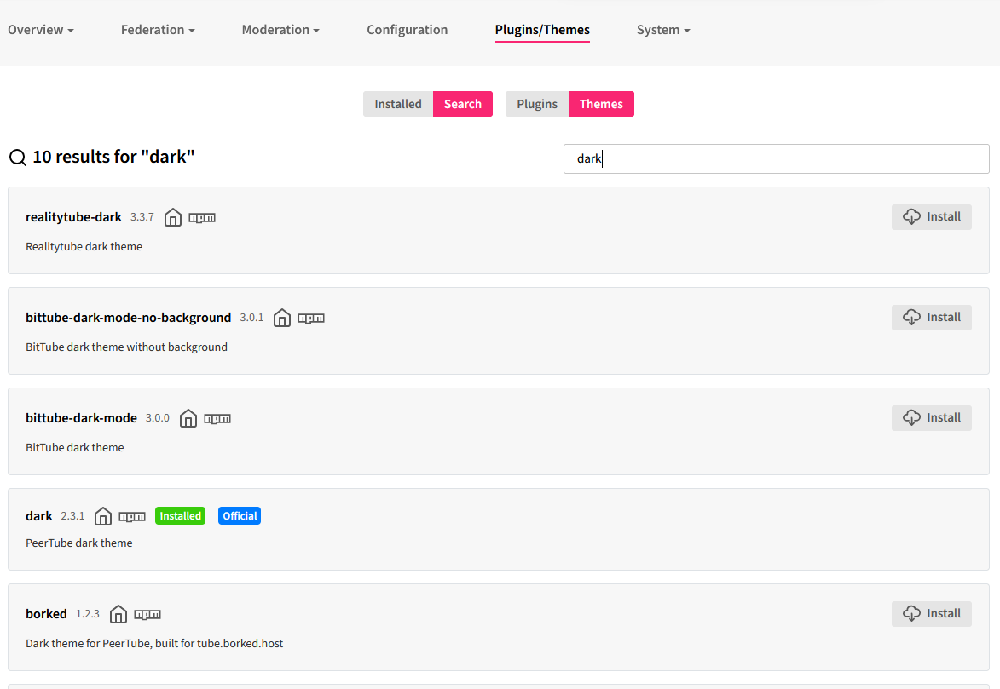

PeerTube is a really nice self-hostable YouTube alternative that [Jim](https://bavatuesdays.com) has been using for a bit and introduced me to. I wanted to spin up my own install at [video.jadin.me](https://video.jadin.me) and theme it a bit to fit in with this blog site. 

The first thing I did was install the dark theme, which I thought would more closely match my blog site as a starting point. You can do this from **Administration > Plugins/Themes**. I grabbed the official dark theme:


After installing it, you will need to enable it from the **Administration > Configuration > Basic** page. 

What I really wanted to do was change the accent colors in the interface, as well as hide some areas of the interface that I felt were unnecessary given the way I use Peertube[^1]. Custom CSS can be entered on the **Administration > Configuration > Advanced** page.

I wanted to post my CSS customizations here in case anyone finds them to be useful. Note that these are most likely  specific to the dark theme I am using, so they may require tweaking if you are using a different theme. I was able to do some cool things like hide the entire menu drawer and publish button if you aren't logged in!

```css
/* Change colors */
body#custom-css {
  --mainColor: #f92672;
  --mainColorLighter: #e5789b;
  --mainColorLightest: #dbdbdb;
  --mainHoverColor: #9f1f49;
  --secondaryColor: #98BE47;
}

/* Fix the background of the playlist info section in the dark theme */
.playlist-info {
  background-color: transparent !important;
}

/* Hide the publish button, the menu button, and the drawer if not logged in */
.user-not-logged-in > .root-header > .root-header-right > my-header > .publish-button,
.user-not-logged-in > .root-header > .top-left-block > .icon-menu,
.user-not-logged-in > .sub-header-container > .ng-star-inserted > .menu-wrapper
{
display: none !important;
}

/* Fix the spacing when the menu is hidden when you aren't logged in */
.user-not-logged-in > .sub-header-container > .main-col {
  margin-inline-start: 0px;
  width: 100%;
}

/* Hide various other things */
.login-buttons-block, /* login buttons, I just login by going to /admin */
.block-title, /* hide the "on video.jadin.me" thing */
div.active-filter  /* hide the filter badges*/
{
  display: none !important;
}

/* right align the search bar */
my-search-typeahead.w-100 {
  justify-content: right !important;
}
```

[^1]: For instance, the sensitive content filter. I don't have any of that on my PeerTube instance, so that button is unnecessary