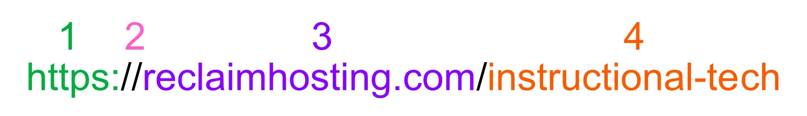

A very, very, common thing that I find myself doing while working with web stuff is copying a long URL, but only needing the domain name part to paste into a terminal or elsewhere. It's annoying to carefully select just part of the URL, and even more annoying to manually delete the parts I don't need:

<video style="max-width:100%" autoplay loop muted controls>
	<source src="copypastebefore.mp4">
	Your browser does not support the video tag.
</video>

I love automating and making little shortcuts to simplify repetitive tasks like this!

After wasting time trying to do this with regular expressions, [Nick Plank](https://flyingchaucer.net) pointed me in the right direction. All I needed was to programmatically divide the text up into groups using the forward slash as a separator, then grab the text in the third group. Here's a visual:



You can see that the main domain part, the part I want, is the third group. This is because there are two slashes in a row after **https://**, so that group exists, but is empty. This methodology works great for my needs here, but I quickly realized I'd also have to check if my URL began with **https://** or **http://** because sometimes they don't when they get copied, and in that case I would want to select the first grouping instead:


With the game plan set, it was time to write a tiny little bash script to try it out:

```bash
#!/bin/bash
clipboard=$(pbpaste)
start=$(echo $clipboard | cut -d/ -f1)

if [ $start = "https:" ] || [ $start = "http:" ]; then
	domain=$(echo -n $clipboard | cut -d/ -f3)
else
	domain=$(echo -n $start)
fi
echo -n $domain
echo -n $domain | pbcopy
```

The script basically just gets the contents of the clipboard using `pbpaste` and uses `cut` to divide the URL into parts using by the forward slash as the separator. If the URL starts with **https:** or **http:** it will grab the 3rd group of text, and if not it grabs the first group. Finally, it prints out the domain to the terminal, then uses `pbcopy` to copy the domain name to the clipboard. 

This works well, but I don't really want to have to open a separate terminal to use it all the time[^1], so I used this script to make an [Alfred](https://www.alfredapp.com/) workflow. Now I can trigger all of that automation by just typing `;domain` anywhere on my Mac!

<video style="max-width:100%" autoplay loop muted controls>
	<source src="alfred-demo.mp4">
	Your browser does not support the video tag.
</video>

If you'd find this useful, and you are an Alfred user, you can get my workflow here:

[⬇️ Domain-snippet.alfredworkflow.zip](Domain-snippet.alfredworkflow.zip)

[^1]: Pay no attention to the fact that my demo video shows me pasting this into a terminal, lol. I'm often pasting domain names into web pages or Slack as well!
