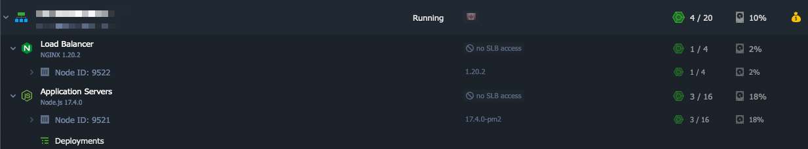
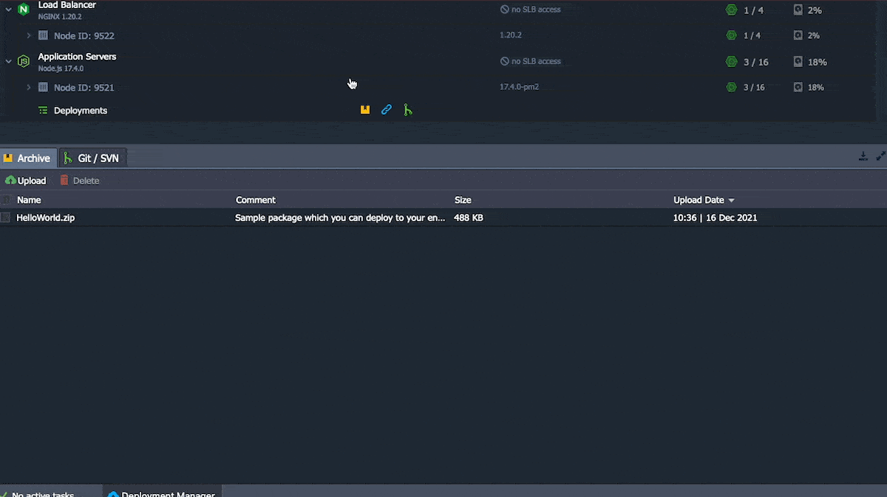

This is a quick little post to document something I've found handy! A common way to issue a Let's Encrypt cert and get things to load on Reclaim Cloud over HTTPS is to use an NGINX Load Balancer. Here's an example environment, one I use to run [Foundry Virtual Tabletop](https://jadin.me/foundry-on-reclaim-cloud/):



The trick is some applications that you run won't automatically redirect URLs with HTTP to HTTPS, so you have to manually type HTTPS in your address bar. Turns out, with a quick config change in NGINX, you can have the load balancer redirect all HTTP requests to HTTPS!

The first step is to use the config panel to make a new file in the `conf.d` folder for nginx. I called mine `redirect.conf`.



Then you can put the following text in the file and save the file:

```
server {
       listen *:80 default_server;
       access_log /var/log/nginx/redirect.access_log main;
       error_log /var/log/nginx/redirect.error_log info;
       location / {
         rewrite ^ https://$host$request_uri? permanent;
       }
}
```

Then, click the Restart Node button for the NGINX node in Reclaim Cloud, and you are all set!