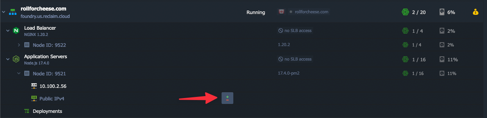

I recently needed to back up a bunch of files, about 6GB, from a Reclaim Cloud node so here are some notes on how I was able to connect directly to the Node. I like using the [Reclaim Cloud SSH Gate](https://support.reclaimhosting.com/hc/en-us/articles/4404920655127-Using-the-SSH-Gate) for SSH or SFTP access to containers most of the time, but in my case because I had so many files to sync, I wanted to use [rsync](https://www.digitalocean.com/community/tutorials/how-to-use-rsync-to-sync-local-and-remote-directories), which as far as I'm aware won't work with the SSH Gate. 

The first thing I needed to do was add attach a public IP address to the node I was using, as it didn't already have one.



I wanted to use password authentication to connect, so I next needed to get Root access to the node, which is pretty easy to do and documented here:

[Root Access to any Container - Reclaim Hosting Support](https://support.reclaimhosting.com/hc/en-us/articles/4404920687383-Root-Access-to-any-Container)

Once I had root access, I could change the password on the root user (or any other user for that matter):

``` bash
sudo su - #Switch to the root user
passwd
```

Finally I had to enable password authentication, as this particular node's SSH config was not set to allow password logins. I had to edit the `/etc/ssh/sshd_config` file and find this line near the bottom of the file:
```
PasswordAuthentication no
```

Changing that to yes and saving the file did the trick. Finally, I had to restart the SSH service in the node to get it to read my changes:

```
sudo systemctl restart sshd
```

After that, I was in business!

## For next time

As of writing this post, I realized I could have skipped a lot of steps by simply using a [public/private key pair](https://support.reclaimhosting.com/hc/en-us/articles/8421003621015-Generating-and-using-SSH-key-pairs), so I'm mentioning this here for when I inevitably reference this in the future. In this case I would have just needed to add the public IP to the node, then copy the contents of my public key and paste that into a new line in the `~/.ssh/authorized_keys` file in the node. That would have saved me from needing root access, changing passwords, and changing the SSH config. 