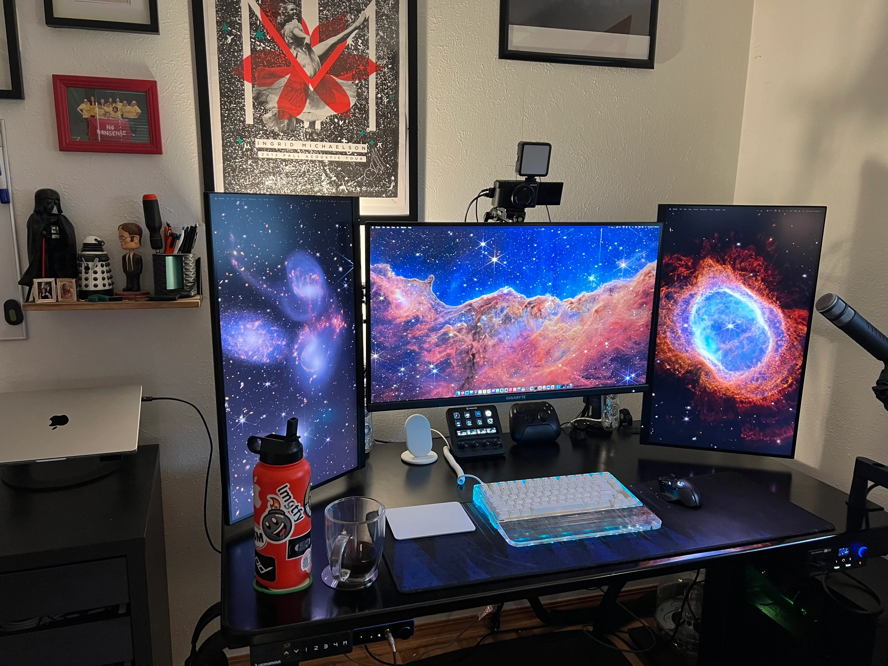

It has been way too long since I've blogged, so I'll dip my toes back in with a small update from my [desk setup post from February](/desk-setup).

I recently added a third monitor to my setup, a [refurbished Gigabyte M32U](https://www.gigabyte.com/Monitor/M32U) that I got for a pretty good deal! It's a 32" 4K monitor, which has been an awesome upgrade in terms of screen real estate, and sharpness of text for my primary monitor! With that addition, I've got that monitor in the center, and the two [M27Q](https://www.gigabyte.com/Monitor/M27Q-rev-10#kf)'s on either side in portrait orientation. 

The tricky part here was getting everything mounted. My desk isn't very big, plus I prefer monitor mounts over the included stands that monitors typically come with. This way I get that extra desk space and the flexibility to do things like use two monitors in portrait orientation! I ended up getting a third one of these [VIVO single monitor mounts](https://www.amazon.com/dp/B00B21TLQU) (I already had two) and I kind of frankensteined them together to have two poles that hold three monitors at different heights.

The best part is I am still able to use this whole setup with my work laptop (which now stays closed in clamshell mode on top of a cabinet on the left) and my desktop! Now I just need to do some cable management!