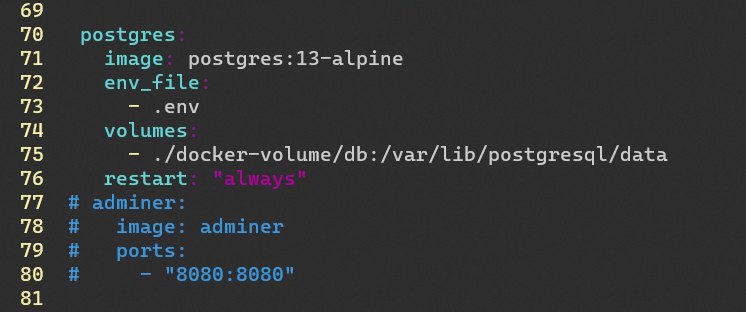

Here are some quick notes from helping [Jim](https://bavatuesdays.com) upgrade his [bava.tv](https://bava.tv/) Peertube instance from PostgreSQL 10 to PostgreSQL 13. bava.tv uses Docker so actually changing Postgres versions is dead simple (basically just edit a number in the `docker-compose.yml` file and restart the containers) but we found out pretty quickly that you can't just change the version of Postgres and expect the database to still work.

First I cloned the environment so I could do some testing and added [Adminer](/db-webui-for-docker/) to the `docker-compose.yml` file. This way I could poke around the database and try exporting and importing stuff, but I had all kinds of errors related to overwriting tables that already existed. It seems like Postgres is very protective about what things you can overwrite or tables you can drop because it has a concept of what tables are related to each other.[^1]

[^1]: That was the problem as best as I can tell. I'm very very far from a DB admin 🤷‍♂️

After [reading the docs a bit](https://www.postgresql.org/docs/current/upgrading.html) it seemed like the most straightforward way is to dump the database on the old version using `pg_dumpall`, upgrade the version of Postgres, then restore the database. `pg_dumpall` will dump not on the **public** [schema](https://www.postgresql.org/docs/current/ddl-schemas.html) that has all the data we care about, but also the other schemas that mostly seems to contain metadata.

After finding out about `pg_dumpall` I also stumbled upon this blog post about upgrading Postgres in Docker, which was pretty useful:

[How to Upgrade Your PostgreSQL Version Using Docker](https://betterprogramming.pub/how-to-upgrade-your-postgresql-version-using-docker-d1e81dbbbdf9)

I did tweak things slightly when it came to restoring the database, as their method was a bit more complicated than mine.

Here was my actual procedure for doing this with [bava.tv](https://bava.tv), after I figured out what I was doing:

### `cd` to the folder PeerTube is running from
In this particular case `/home/peertube`.[^2]
```bash
cd /home/peertube
```
[^2]: For most installs made with our installer it will be at `/root`. [bava.tv](https://bava.tv) predates our PeerTube installer.

### Dump the database using `pg_dumpall`
```bash
docker-compose exec postgres pg_dumpall -U bavatube > dump.sql
```
`docker-compose exec postgres` tells Docker to execute `pg_dumpall -U bavatube` inside our postgres container, and then `> dump.sql` redirects that output to a file so we can restore it later.

### Stop all containers and delete the database
```bash
docker-compose down
rm -rf docker-volume/db/
```

### Edit the `docker-compose.yml` file to upgrade PostgreSQL
```bash
vim docker-compose.yml
``` 
We just need to change the tag for the postgres container, so we replace `image: postgres:10-alpine` with `image: postgres:13-alpine`.


### Start up the Postgres container (and nothing else)
```bash
docker-compose up -d postgres
```
We need to start up just the database and not the PeerTube itself so we have a completely empty database to restore our database dump in to. If we allow the PeerTube container to also start up, it will see an empty database and automatically populate it with some data.

### Restore the database dump
```bash
docker-compose exec -T postgres psql -U bavatube -d peertube < dump.sql
```

### We're done! Start up all the other containers for PeerTube!
```bash
docker-compose up -d
```