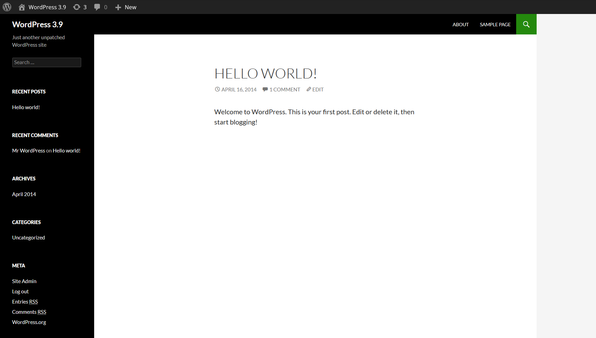

Following up [my last post](/spinning-up-a-pretty-old-wp-site-using-docker-compose/), I realized that I wasn't looking through the tags on Docker Hub properly, and the earliest version available as a pre-built container [is actually WordPress 3.9](https://hub.docker.com/_/wordpress/tags?page=1&ordering=-last_updated)!

I had to take a closer look at the logs and make some guesses, as it turns out the environment variable for pointing WordPress to the right database host is different, and its hard to find info on using 8 year old docker images, but I got it working:

```yaml
version: "3"
services:
  wordpress:
    image: wordpress:3.9
    restart: unless-stopped
    ports:
      - 80:80
    environment:
      WORDPRESS_DB_USER: wp
      WORDPRESS_DB_PASSWORD: PASSWORDGOESHERE
      WORDPRESS_DB_NAME: wordpress_db
      MYSQL_PORT_3306_TCP: 'mysql'
    volumes:
      - ./public_html:/var/www/html
  mysql:
    image: mysql:5.7.42
    restart: unless-stopped
    environment:
      MYSQL_DATABASE: wordpress_db
      MYSQL_USER: wp
      MYSQL_PASSWORD: PASSWORDGOESHERE
      MYSQL_ROOT_PASSWORD: ANOTHERPASSWORDGOESHERE
    volumes:
      - ./db:/var/lib/mysql

```

Really the only difference in the compose file is the version number for WordPress and the `MYSQL_PORT_3306_TCP`  environment variable instead of  `WORDPRESS_DB_HOST`.

Success!

