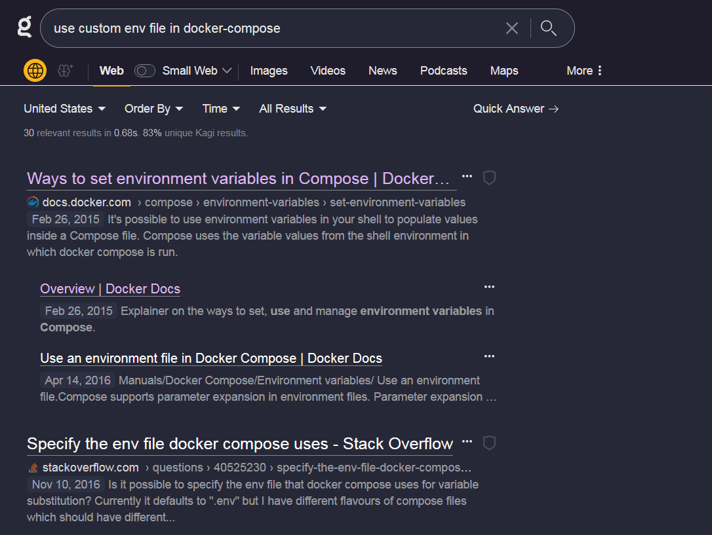

While I'm not completely averse to using Google stuff, I stopped using Google search a few years ago, just to make sure all of my data eggs aren't just in Google's basket. They already get my email, most of video watching, lots of work documents, and so many other things. For the last few years I've been using DuckDuckGo, which I honestly really like, but I will admit that at times its search results can at times be subpar compared to Google, or at least that's my perception.

Overall, I like and recommend DuckDuckGo. Their [privacy policy is good](https://duckduckgo.com/privacy), the [!Bang feature is amazing](https://duckduckgo.com/duckduckgo-help-pages/features/bangs/)[^1], the design is nice and clean, and they still have a good amount (but not too many) "quick answers" type features and tools. That being said, I'm getting pretty fed up with the AI listicle spam garbage that seems to be cluttering search engines recently, and most of the major search engines all seem to be susceptible (even Google),

[^1]: I honestly think I'd have a hard time switching to a search engine that doesn't have this.

I started hearing about [Kagi](https://kagi.com/) a couple of months ago, so I decided to give it a shot as my primary search engine for a month. The big deal with Kagi is that it is a paid search engine. So it is not free, it requires an account, and there are no ads. I think most exciting to me is the idea that being a paid product might actually [allow this company to align its incentives with me, their customer, in a straightforward way](https://dkb.io/post/DEPR_kagi-interview):I pay them money, and they deliver good a search experience. If the search engine isn't good, I'm probably going to stop paying and go somewhere else.

## Good stuff

I don't know if I can definitively say the search results are the best (that would be hard to measure), but I can say I like it so far. It seems to do a good job of filtering out junk SEO sites, and even has features where it will [automatically group together listicles](https://help.kagi.com/kagi/settings/search.html#overview) so they don't clutter up the rest of the results on the page.

I've also really enjoyed some of the LLM powered features they've been working on. I've found it's really handy to just click that "quick answer" button when I realize that my search query could probably be easily answered this way. This is particularly true for technical or code related questions, where I can immediately find out if the response is accurate or not.

I also really like the [lenses](https://help.kagi.com/kagi/features/lenses.html) feature. It's so nice to be able to drill down to a specific genre of site you are looking for, and the fact that they have a [small web](https://blog.kagi.com/small-web) lens to focus on blog posts warms my heart a bit.

Finally, the ability to [uprank or downrank particular sites or domains that you like (or dislike)](https://help.kagi.com/kagi/features/website-info-personalized-results.html) in your search results is genius. Right off the bat, if I'm searching for info on the best piece of software for a given task, I literally never want to see info from slant.co, for instance. A happy surprise is I haven't used this feature much because spammy sites don't show up too much in my Kagi searches!

## Worth it?

Is Kagi worth paying for? If you spend a lot of time thinking about how the web works, care about its future, or if the current state of search engines really bothers you, then maybe. There are [three plans to consider](https://kagi.com/settings?p=billing_plan). The ultimate plan seems to really just be for early adopters and Kagi super fans, and does not seem worth it to me at $25. The $5 a month plan is limited to 300 searches a month, which I think I'd blow through way too fast.

For now, I think I will keep using the $10 a month plan. I'm enjoying using Kagi, and I think I'm getting my money's worth as someone who uses search engines a lot. That being said, I'm still conflicted, and it does still seem expensive to me even though I really care about this kind of stuff.[^2] This does seem like a better value than the $20 a month some people pay for the paid version of ChatGPT 🤷‍♂

[^2]: I'm also interested in the [watching state of Kagi as a company](https://help.kagi.com/kagi/company/). Will they be sustainable with this pricing?