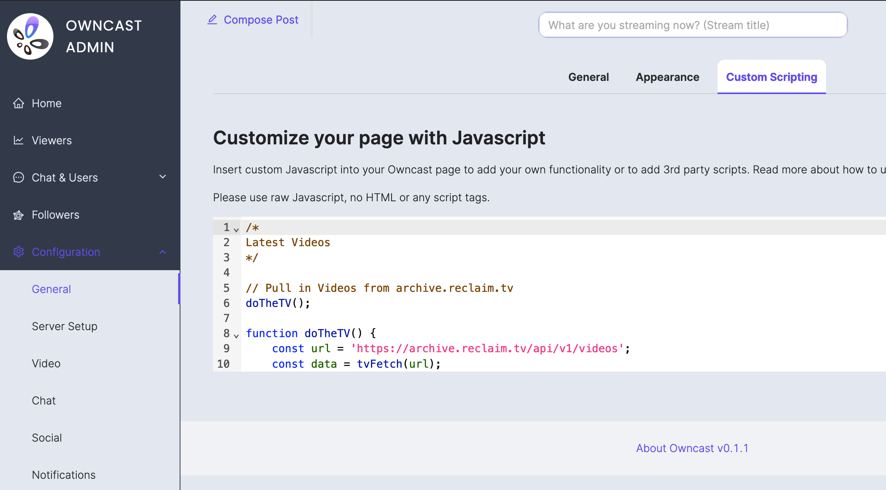

One of my big goals for the year at Reclaim was to really beef up the video platform we use at Reclaim for our streams, as well as flex courses and workshops. We do publish stuff to YouTube, and we're certainly not leaving that behind, but I wanted self-hostable and federated stuff like Peertube and Owncast to really feel like first-class citizens for us.

I think getting into all the tools we are using would and the surrounding workflow would be a good topic for another post, but for now I wanted to document how I've been customizing the UI of Owncast to fit our needs on [reclaim.tv](https://reclaim.tv)! There are two main things we've done with the default Owncast UI, the first was pulling in videos from our Peertube, where all streams and other video content get archived. The second was to replace Owncast's default chat with an embeddable version of the #livestreams channel from our Discord. 

I'm going to embed snippets of code in this post, but if you want to take a look at of it, check out this git repository:

[GitHub - reclaimhosting/reclaim.tv-customizations](https://github.com/reclaimhosting/reclaim.tv-customizations/)

## Embedding Peertube videos at the bottom of the page

The JavaScript here wasn't too bad because I was able to borrow most of the code from [Tom Woodward's](http://bionicteaching.com/) work on our [Reclaim Community](https://community.reclaimhosting.com/) site. I just had to adapt it a tiny bit to pull in thumbnails for videos from the Peertube API.

```js
/*
Latest Videos
*/

// Pull in Videos from archive.reclaim.tv
doTheTV();

function doTheTV() {
    const url = 'https://archive.reclaim.tv/api/v1/videos';
    const data = tvFetch(url);
}

async function tvFetch(url) {
    const response = await fetch(url);
    const data = await response.json();
    makeTVList(data);
}

function makeTVList(data) {
    const destination = document.getElementById("latest-videos");
    const preview = data.data;
    //console.log(preview);
    let postCount = 0;
    preview.forEach((element) => {
        postCount = postCount + 1;
        //console.log(postCount)
        if (postCount < 26) {
            const link = element.url;
            const title = element.name;
            const thumbPath = element.thumbnailPath;
            const div = document.createElement("div");
            div.classList.add('tv-past');
            div.innerHTML = `
					<a href="${link}">
						<div class="thumb"></div>
						<div class="title">${title}</div>	            	
					<a/>
				`;
            destination.appendChild(div);
        }
    });
}
```

This JavaScript just went straight into the Owncast Admin's "Customize your page with Javascript" area.



Next, I needed to put a div with the id of "latest-videos" on the page for the javascript to add videos and thumbnails to.

```html
<div id="latest-videos"></div>
<h3 class="latest-videos-footer"><a href="https://archive.reclaim.tv">More videos...</a></h4>
```

This I did by just putting HTML inline with the markdown in "Custom Page Content."


Finally, I needed to use CSS to style it and make it into a nice grid. This part took longer than the javascript for me because I wasn't borrowing most of it, and I hadn't done much with grid layouts in CSS before. This is what I landed on with some tinkering to make it work well on desktop, phones, and tablets:

```css
/* 
Latest Videos
*/

/* Hide latest-videos-footer if the video grid is empty.
   Helps things break "gracefully" when resizing the window. */
#latest-videos:empty+.latest-videos-footer {
  display: none;
}

/* Style the latest-videos grid */
#latest-videos {
  display: grid;
  grid-template-columns: repeat(1, 1fr);
  gap: 10px;
  grid-auto-rows: minmax(100px, auto);
}

@media (min-width: 650) {
  #latest-videos {
    grid-template-columns: repeat(2, 1fr);
  }
}

@media (min-width: 1000px) {
  #latest-videos {
    grid-template-columns: repeat(3, 1fr);
  }
}
```

Owncast has a spot for Custom CSS as well, so I threw the CSS in there.


Here's what it looks like now when you scroll below the video player!


## Replacing Owncast's built-in chat with Discord Chat

Emboldened by the relative ease of adding Peertube videos from the page, later on we decided to replace Owncast's built-in chat with an embed of the #livestreams channel of our Discord. This leverages [Widgetbot](https://widgetbot.io) for the actual embedding, which we've used for our workshop and flex course [watch sites](https://watch.reclaimed.tech/open-publishing-ecosystems) at Reclaim for a while now, and it works great! The real trick was figuring out how to effectively replace Owncast's pre-existing chat feature with this. For technical reasons that I don't understand super well[^1], Owncast doesn't let us merely edit the default page, we'd have to do it purely from the browser-side using Javascript to replace the chat.

[^1]: Owncast is distributed as a single binary that you run, and so I think to change some of its templates entirely we'd need to fork the code and build our own version, then run that forked version, which would be a pain compared to the way I've done it here.

The javascript was pretty tricky for me to figure out here, as I just haven't done this kind of thing before. After doing some basic exploration and proof-of-concepting using the Developer tools in my browser, I knew that basically I needed to set up an iframe, then replace a particular div on the desktop version, and another one on the mobile version. 

The trick is Owncast only displays the chat if there's a stream actually happening, so I'd first need to wait for the chat to show up, then replace it with the Discord chat and make a few other changes to the page. Basically, ever half second your browser is checking to see if a div with the id of "virtuoso" exists, which is where the chat should go. Once it finds that div, it does all the work.

```js
/*
Discord Chat
*/

// set up iframe
const iframeElement = document.createElement('iframe');
iframeElement.src = 'https://e.widgetbot.io/channels/954008116800938044/1106692850470633573';
iframeElement.height = '100%';

// wait until div with id 'virtuoso' exists, then replace it with discord chat
var interval = setInterval(checkDiv, 500);
function checkDiv() {
    if (document.getElementById('virtuoso')) {
        // div exists
        clearInterval(interval);

        const divElement = document.getElementById('virtuoso');
        // Replace the div element with the iframe
        divElement.replaceWith(iframeElement);

        // Edit User Menu text
        const userMenu = document.querySelector('#user-menu');
        const userMenuText = userMenu.querySelector(':nth-child(2)');
        userMenuText.textContent = 'Toggle Chat';

        // Make user-menu button toggle display of chat
        document.getElementById("user-menu").onclick = function () {
            var div = document.getElementById("chat-container");
            if (div.style.display === "none") {
                div.style.display = "flex";
            } else {
                div.style.display = "none";
            }
        };
    }
}
```

On mobile, I just went the route of loading the Discord embed every single time you click the "Chat" button. I'm waiting half a second here too because I found that if the replacement happened too quickly it would sometimes not work properly. 
```js

// Replace built-in Chat with Discord on Mobile every time you click the button
var mobileInterval = setInterval(checkDiv, 500);
function checkMobileDiv() {
    if (document.getElementById('chat-container')) {
        // div exists
        clearInterval(mobileInterval);

        // Get reference to the div element
        const divElement = document.getElementById('chat-container');
        // Replace the div element with the iframe element
        divElement.replaceWith(iframeElement);
    };

}
```

There is likely a better way, or more proper way, to do all of this, but it works. I also learned quite a bit about working with javascript throughout this project.

After that, I just had to make hide a few things that we no longer needed, and tweak the height of something on mobile. Here's the CSS for all that:
```css
/*
Discord Chat
*/

/* Hide some stuff we don't need when using Discord chat */
#chat-input,
#user-menu>span:nth-child(3),
#chat-modal-user-menu {
  display: none;
}

/* Hide User-menu Dropdown on desktop only */
@media (min-width: 767px) {
  .ant-dropdown.ant-dropdown-placement-bottomLeft {
    display: none;
  }
}

/* Mobile only fixes for Discord chat */
@media (max-width: 767px) {
  #user-menu {
    display: none;
  }

  .ant-modal-header {
    min-height: 50px;
  }
}
```

And that's all of it! Just like with the Peertube video embeds, this all was code that just ended up going in to Owncast's admin interface in the appropriate places, and if you want to see all of it in one place, or want to see the most up-to-date version of it, check out the [github repository](https://github.com/reclaimhosting/reclaim.tv-customizations/).

The end result on desktop looks pretty good,[^2] and the pink "Chat" button will toggle it being shown or hidden:


[^2]: Although this screenshot isn't maybe the best with just a single cropped message in Discord showing, but it's the best I have available as I write this on my iPad during some Thanksgiving downtime.

On phones, I'm also pretty happy with the end result:
<video style="max-width:100%" autoplay loop muted controls>
	<source src="mobile-chat.mp4">
	Your browser does not support the video tag.
</video>