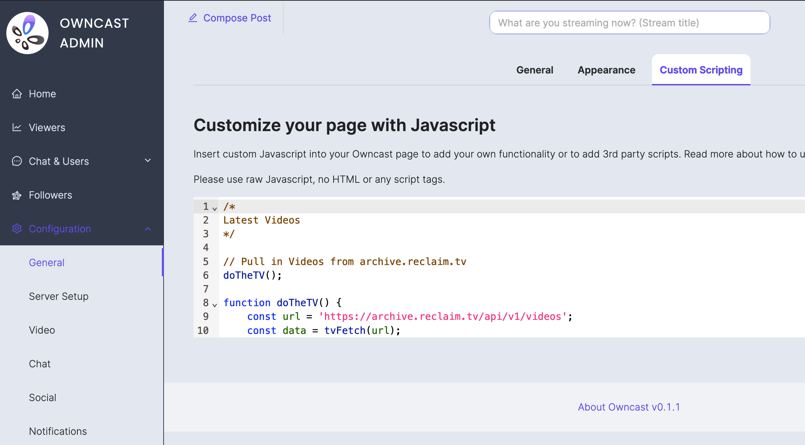

One of my big goals for the year was to really beef our the video platform we use at Reclaim for our streams as well as flex courses and workshops. We do publish stuff to YouTube, and we're certainly not leaving that behind, I wanted self-hostable and federated stuff like Peertube and Owncast to really feel like first-class citizens for us at Reclaim. I think getting into all the tools we are using would and the workflow around them would be a good topic for another post, but for now I wanted to document how I've been customizing the UI of Owncast to fit our needs on [reclaim.tv](https://reclaim.tv)! There are two main things we've done with the default Owncast UI, the first is pulling in videos from our Peertube, where all streams and other video content get archived. The second is to replace Owncast's default chat with an embeddable version of the #livestreams channel from our Discord. 

I'm going to embed snippets of code in this post, but if you want to take a look all of it, check out this git repository:

[GitHub - reclaimhosting/reclaim.tv-customizations](https://github.com/reclaimhosting/reclaim.tv-customizations/)

## Embedding Peertube videos at the bottom of the page

The JavaScript here wasn't too bad because I was able to borrow most of the code from [Tom Woodward's](http://bionicteaching.com/) work on our [Reclaim Community](https://community.reclaimhosting.com/) site. I just had to adapt it a tiny bit to pull in thumbnails for videos from the Peertube API.

```js
/*
Latest Videos
*/

// Pull in Videos from archive.reclaim.tv
doTheTV();

function doTheTV() {
    const url = 'https://archive.reclaim.tv/api/v1/videos';
    const data = tvFetch(url);
}

async function tvFetch(url) {
    const response = await fetch(url);
    const data = await response.json();
    makeTVList(data);
}

function makeTVList(data) {
    const destination = document.getElementById("latest-videos");
    const preview = data.data;
    //console.log(preview);
    let postCount = 0;
    preview.forEach((element) => {
        postCount = postCount + 1;
        //console.log(postCount)
        if (postCount < 26) {
            const link = element.url;
            const title = element.name;
            const thumbPath = element.thumbnailPath;
            const div = document.createElement("div");
            div.classList.add('tv-past');
            div.innerHTML = `
					<a href="${link}">
						<div class="thumb"></div>
						<div class="title">${title}</div>	            	
					<a/>
				`;
            destination.appendChild(div);
        }
    });
}
```

This javascript just went straight into the Owncast Admin's "Customize your page with Javascript" area.



Next, I needed to put a div with the id of "latest-videos" on the page for the javascript to add videos and thumbnails to.

```html
<div id="latest-videos"></div>
<h3 class="latest-videos-footer"><a href="https://archive.reclaim.tv">More videos...</a></h4>
```

This I did by just putting HTML inline with the markdown in "Custom Page Content."


Finally I needed to use CSS to style it and make it into a nice grid. This part took longer than the javascript for me because I wasn't borrowing most of it, and I hadn't done much with grid layouts in CSS before. This is what I landed on with some tinkering to make it work well on desktop, phones, and tablets:

```css
/* 
Latest Videos
*/

/* Hide latest-videos-footer if the video grid is empty.
   Helps things break "gracefully" when resizing the window. */
#latest-videos:empty+.latest-videos-footer {
  display: none;
}

/* Style the latest-videos grid */
#latest-videos {
  display: grid;
  grid-template-columns: repeat(1, 1fr);
  gap: 10px;
  grid-auto-rows: minmax(100px, auto);
}

@media (min-width: 650) {
  #latest-videos {
    grid-template-columns: repeat(2, 1fr);
  }
}

@media (min-width: 1000px) {
  #latest-videos {
    grid-template-columns: repeat(3, 1fr);
  }
}
```

Owncast has a spot for Custom CSS as well, so I threw the CSS in there.


## Replacing Owncast's built-in chat with Discord Chat

Embol