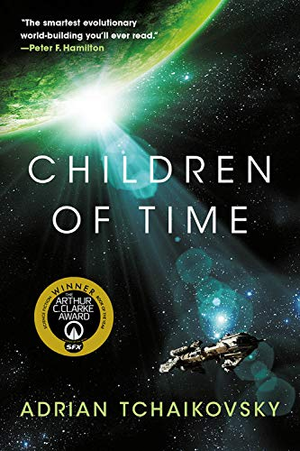
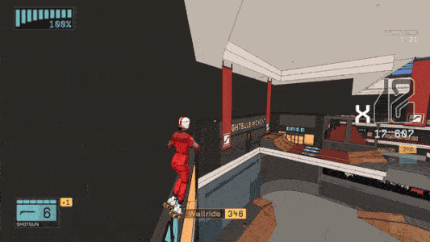
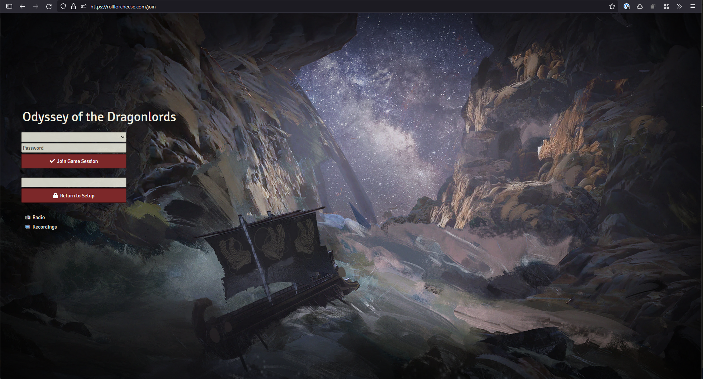

I've been meaning to do more blogging thats small and simple, so I think I'll start doing some more posts that are journal-ish. I'm not sure that I'm committing to a common format or time-frame or anything 🤷🏻‍♂️. We'll see if i stick to this.

## Reading

I just finished [Children of time by Adrian Tchaikovsky](https://www.fictiondb.com/series/children-of-time-adrian-tchaikovsky~58994.htm). It's far future sci-fi where humans have to escape earth and find a new home in the stars, and come across a terraforming experiment from a past human civilization. I really enjoyed it and the ending was just fantastic and unexpected. It has been a very very long time since I finished a fiction novel, so felt great to finish this on top of the fact that I loved it. 

## Games

I've been playing [Rollerdrome](https://store.steampowered.com/app/1294420/Rollerdrome/) this week, which just came out. It's a fantastic indie game that's like [SSX Tricky](https://en.wikipedia.org/wiki/SSX_Tricky) meets [Vanquish](https://store.steampowered.com/app/460810/Vanquish)[^1]. You skate around, shoot at enemies in an arena, try to survive and reload your weapons by landing tricks. I've mostly been playing on the Steam Deck. Can't recommend it highly enough.

[^1]:Not a relatable comparison? Fine its [Tony Hawk’s Pro Skater](https://en.wikipedia.org/wiki/Tony_Hawk%27s_Pro_Skater_(video_game)) meets DOOM.

 

I've also been playing [Yakuza Kiwami](https://store.steampowered.com/app/834530/Yakuza_Kiwami/) which is a remake/reimagining of the original PS2 game that started the series. I played Yakuza 0 a few years back and loved its over-the-top goofiness and melodrama. This is more of that in a good way, so far.

## Work

These last few weeks I've been doing [a lot of streaming](https://video.jadin.me/) on [Reclaim Cloud related stuff](/new-ghost-installer/) and [other Reclaim EdTech things](/understanding-containers-debrief/). I've also been working on helping Jim migrate ds106.tv to a new Docker-based peertube install, and learning a lot about working with Postgres databases throughout the process. I like this way of documenting things, and I'm getting more comfortable with this particular setup in OBS that Jim and I have been using. I stil need to do a big blog post on my desk setup and streaming gear!

Off-stream, I've been preparing for the next few months of Reclaim EdTech events as well as working on the start of a new reporting tool for Domain of One's Own admins with a lot of help from [Tom Woodward](https://bionicteaching.com/).

## Other things

Abby is starting as the new choir director at Oconto Falls High School, and I've been helping her a little bit get her classroom ready. I'm really excited for her and proud of her 😊

I sold my car I've been driving since 2013, and bought a 2015 BMW X1, from my parents actually. I've been having too much fun getting comfy in the new car and learning about its bells and whistles.

I did [some CSS stuff](https://github.com/TaylorJadin/foundryvtt-custom-login/blob/main/foundryvtt/resources/app/public/css/custom.css) to make a custom login page for the Foundry server the D&D group I play in weekly uses. I think it looks pretty cool, and it has nice links to where we keep our private session recordings and the Azuracast station I use to broadcast background music. I've [blogged about Foundry before](https://jadin.me/foundry-on-reclaim-cloud/), but I should do an update on the other tech, radio, and streaming related stuff I do with our D&D group as I've often used it as playground to try out stuff that I would later make use of at work.

Finally, I dumped [Pinboard](https://pinboard.in) as its web archiving feature I pay extra for hasn't really been working for some time. I've moved over to [Raindrop.io](https://raindrop.io) and its browser extensions, mobiile apps, desktop apps, and the whole service are fantastic. Really impressed so far.

Welp, this was supposed to be short, and it wasn't really. This is the first one so that makes sense I suppose, I'll have to keep up with these so they can actually be short!