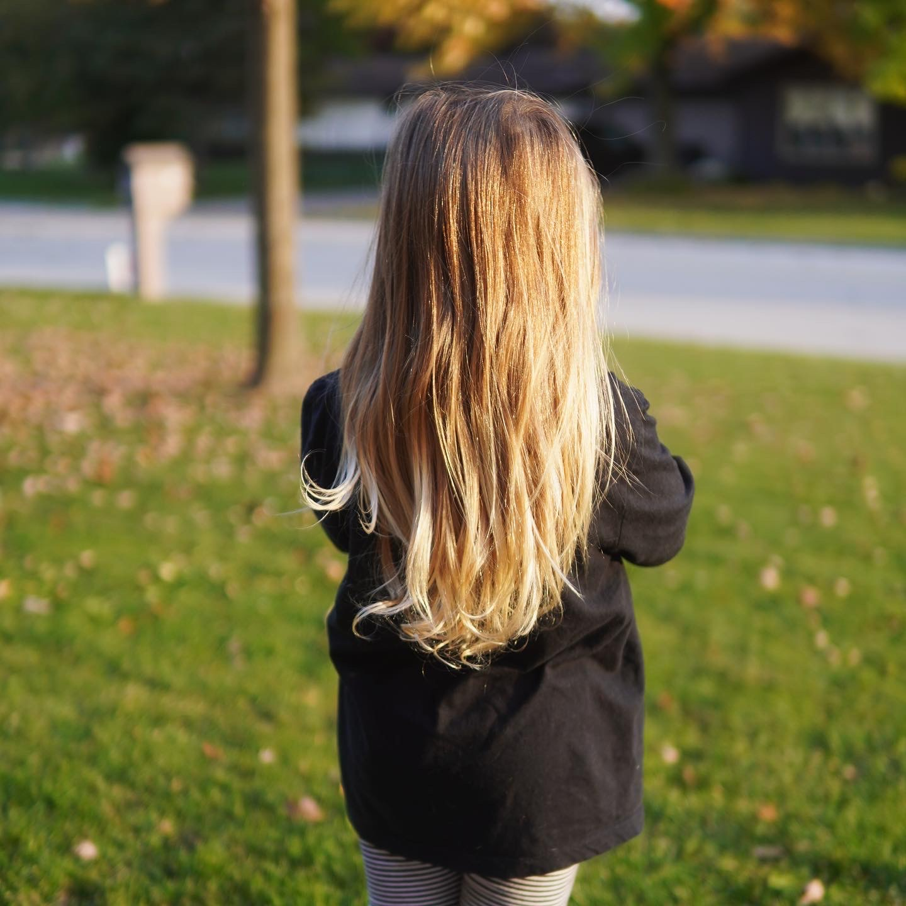
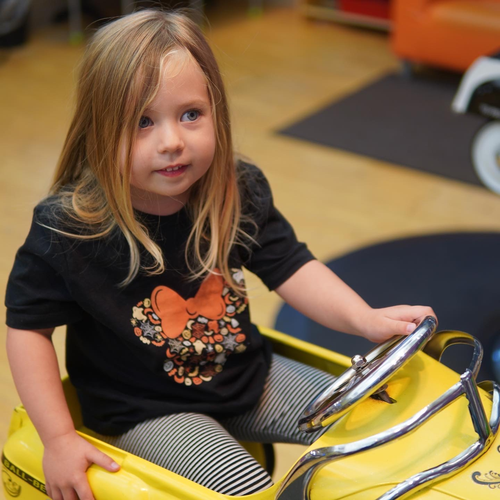
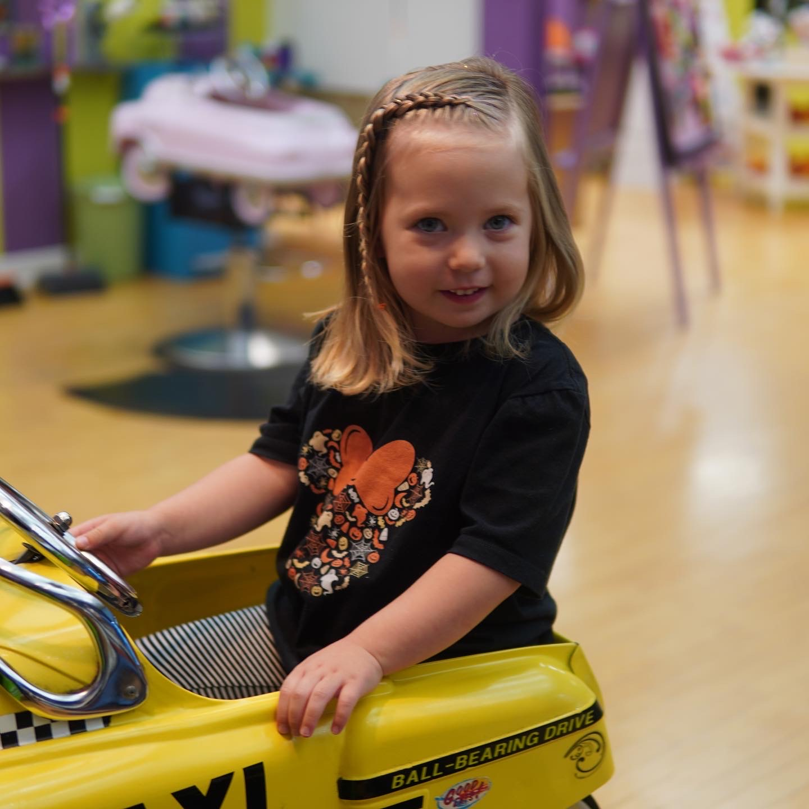
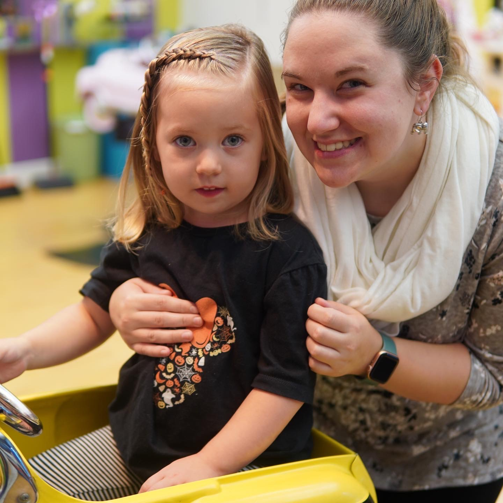
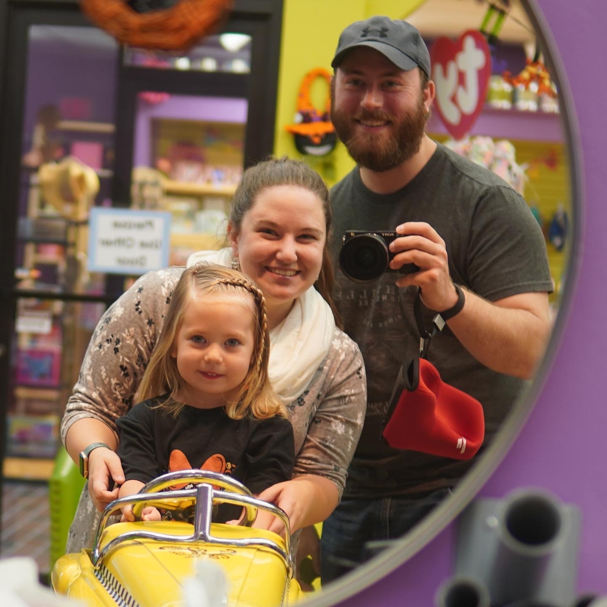

## Work
It feels like a theme lately with many of my projects is getting to put into practice stuff I've been curious about for a while, but never had the time to actually work on. A lot of the stuff I've been learning about regarding Docker, as well as working with APIs, is really coming in handy right now across several projects. With both of those examples, I've worked with them in the past sporadically, but taking the time to participate in (and lead, in some cases) Reclaimed EdTech flex courses has immersed me in this stuff enough to give me more confidence.

Probably the best example: I was able to publish my [first image to Dockerhub](https://hub.docker.com/r/taylorjadin/httrack) as part of a [Site Archiving and HTML flattening toolkit](https://github.com/TaylorJadin/site-archiving-flattening-toolkit/) I've been wanting to work on for a while (years, really). Getting the Understanding Containers workshop together this past summer really got me comfortable enough with Docker that I realized I could make a toolkit like this truly cross-platform and easy to use (as far as command line tools go).

## Nat's First Haircut
Nat got her first haircut today at 3 years old! I need to make more of a point of documenting stuff like this, not just on social media. 

Before:

## After:

## Games
Recently, most of my gaming time has been with friends playing various Arma 3 scenarios, but I've still been playing Destiny 2 when I have a chance. I'm also still playing through Yakuza: Kiwami on my Steam Deck. I think pretty soon I'll shift gears back to Elden Ring to finish that up, as I sort of put that down early this summer. 

## Stuff I'm watching
Abby and I are finishing up Schitt's Creek for the second time. That show is amazing and the whole last season feels like a victory lap in ways that shows in their last season seldom do. 

I've been watching a lot of stuff [James Hoffman's coffee stuff on Youtube](https://www.youtube.com/channel/UCMb0O2CdPBNi-QqPk5T3gsQ) recently. I suppose that's not new, but I've been particularly into it the last couple of weeks.

If you have a few minutes this video that features a latte art printer is particularily amazing:

<iframe width="560" height="315" src="https://www.youtube-nocookie.com/embed/xs9F6-ldjDk?start=799" title="YouTube video player" frameborder="0" allow="accelerometer; autoplay; clipboard-write; encrypted-media; gyroscope; picture-in-picture" allowfullscreen></iframe>

